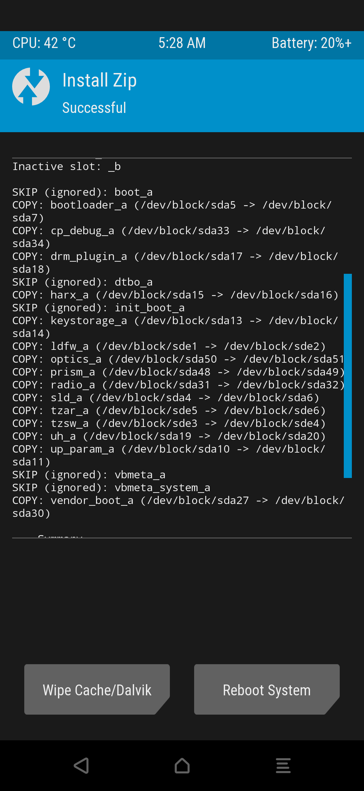
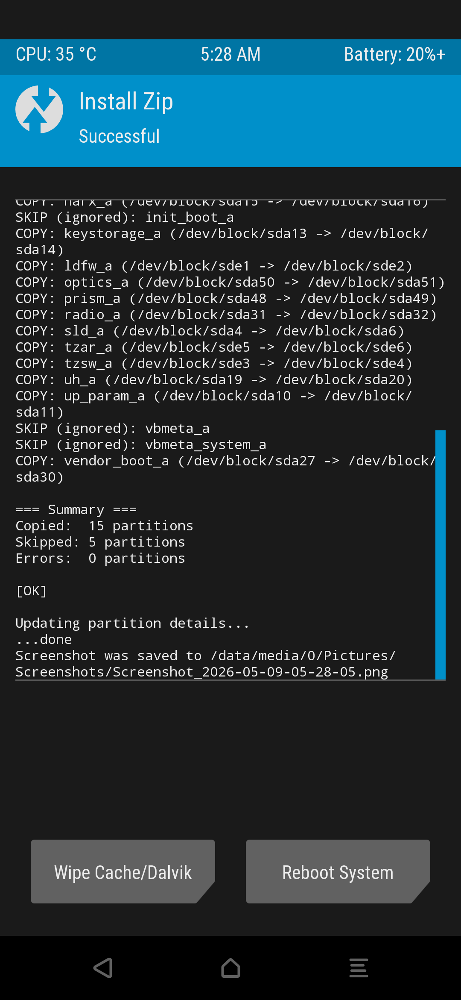

# Copy-Partitions for Samsung Galaxy A55 (SM-A556E)

This is a flashable zip designed to synchronize critical firmware partitions between Slot A and Slot B on the Samsung Galaxy A55 5G.

> ⚠️ **WARNING: Read this entire README before flashing anything. Incorrect usage can lead to a hard brick.**

---

## Why use this?
When flashing custom ROMs (like AOSP, LineageOS, or GSIs), the device switches to the inactive slot. If that inactive slot contains outdated or missing firmware (bootloader, modem, etc.), the device may fail to boot or "hard-brick."

Samsung devices are particularly sensitive to bootloader version mismatches. This script ensures that your "Known Good" firmware from your active slot is cloned to your inactive slot before you switch ROMs.

## Features
- **Samsung A55 Optimized**: Specifically tailored for the SM-A556E partition map.
- **Safety First**: Automatically skips sensitive partitions like `efs`, `sec_efs`, and `steady` to protect your IMEI and device identity.
- **Data Protection**: Never touches `userdata`, `super`, or `metadata`.
- **Fast & Reliable**: Uses optimized block sizes (`bs=1M`) and `fsync` to ensure data integrity.

## What it copies
- **Bootloader**: `bootloader_a/b`, `sld`, `fld`, `uh`, etc.
- **Radio/Modem**: `radio_a/b`, `cp_debug`.
- **TrustZone**: `tzsw_a/b`, `tzar_a/b`.
- **Boot Components**: `vendor_boot_a/b`, `ldfw`, `up_param`.
- **Config**: `optics_a/b`, `prism_a/b`.

---

## ⚠️ Critical Warnings

> ⚠️ **This script is only STEP 1 of a safe ROM flash. It does NOT replace the need for:**
> - A **patched vbmeta** (with `--disable-verity --disable-verification` flags). Without this, Samsung's Verified Boot (AVB) will detect hash mismatches after a custom ROM flash and may lock the device.
> - Following the **exact flash order** specified by your ROM's developer.

### Before you flash:
1. **Verify your model**: This script is built for **SM-A556E** only. Other A55 variants (SM-A556B, SM-A556N) may have different bootloader binaries. Using the wrong variant can trigger anti-rollback and hard-brick the device.
2. **Battery must be above 50%**. A power failure during a slot switch is catastrophic.
3. **Have stock firmware downloaded and Odin ready** as a safety net before you begin.

---

## Correct Flash Order
Follow this exact sequence in your custom recovery (TWRP / OrangeFox):

```
Step 1: Flash copy-partitions ZIP  ← (this script)
Step 2: Reboot back to system      ← Confirm phone still boots!
Step 3: Reboot back to recovery
Step 4: Flash your custom ROM
Step 5: Flash patched vbmeta (if required by ROM instructions)
Step 6: Flash vendor_boot.img (if required by ROM instructions)
Step 7: Wipe Data / Factory Reset
Step 8: Reboot
```

> ⚠️ **IMPORTANT**: After Step 1, you MUST reboot into the system to confirm the phone still works before proceeding. If the phone doesn't boot after copy-partitions, DO NOT continue — reflash stock via Odin.

---

## How to use
1. Download the latest flashable ZIP from the [Releases](https://github.com/simplehima/Samsung-AB-Slot-Syncer-SM-A556E/releases) section.
2. Boot into custom recovery (TWRP/OrangeFox).
3. Flash the ZIP.
4. Verify the summary in the recovery log — ensure **Errors: 0**.
5. **Reboot to system first** to confirm everything is still working.

## Verification & Safety
After flashing, you can confirm the script worked safely by checking:
1. **IMEI**: Dial `*#06#`. If your IMEIs are intact, the security partitions remained untouched.
2. **Baseband**: Check *Settings > About Phone > Software Information*. A valid Baseband version confirms the modem firmware was synced correctly.
3. **Recovery Logs**: The script provides a summary (e.g., "Copied: 15 partitions, Errors: 0"). Ensure errors are 0 before switching slots.

---

## Troubleshooting

### Phone doesn't boot after flashing a ROM (soft brick):
1. Force restart: Hold **Power + Volume Down** for 30 seconds.
2. Enter Download Mode: Hold **Volume Up + Volume Down** while plugging USB into PC.
3. Flash stock firmware via **Odin** (BL + AP + CP + CSC).

### Phone is completely dead — no logo, no Download Mode (hard brick):
1. Hold **Power + Volume Down** for 30+ seconds. Wait 10 seconds. Try again.
2. Leave on charger for 1 hour, then retry Download Mode.
3. Try **Samsung Smart Switch** desktop app → "Emergency software recovery."
4. Check **Device Manager** on PC for any USB device detection while plugging in.
5. If nothing works: The bootloader chain is likely corrupted. This requires **JTAG/ISP professional repair** — software cannot fix this.

> ⚠️ **A hard brick is almost always caused by a vbmeta verification failure or a ROM incompatibility, NOT by the copy-partitions script.** The script only writes to the inactive slot and never modifies the active (running) slot.

---

## Tested Devices
- **Samsung Galaxy A55 5G (SM-A556E)**: ✅ Confirmed working (Firmware, Modem, and Vendor_Boot synced successfully).




---

## Disclaimer
> **USE AT YOUR OWN RISK.** Modifying low-level device partitions is inherently dangerous. While this script has been tested and verified on the SM-A556E, no guarantee is made for other variants or firmware versions. The authors are not responsible for bricked devices, lost data, or voided warranties. Always have a recovery plan (stock firmware + Odin) ready before modifying your device.

## Credits
- Original script by [betaxab/copypartitions](https://github.com/betaxab/copypartitions).
- Audited, modified, and verified for Samsung Galaxy A55 compatibility by this project.
